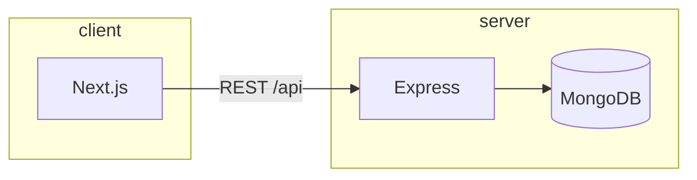

# Process test — candidatures

[](https://github.com/VOTRE_ORG/VOTRE_REPO/actions/workflows/ci.yml)
[](https://codecov.io/gh/VOTRE_ORG/VOTRE_REPO)

Monorepo **backend** (Express, MongoDB) + **frontend** (Next.js).

| Ressource                       | Lien                                                                                                    |
| ------------------------------- | ------------------------------------------------------------------------------------------------------- |
| Application déployée (Render)   | `https://votre-app.onrender.com` _(à remplacer)_                                                        |
| Rapport de couverture (Codecov) | `https://codecov.io/gh/VOTRE_ORG/VOTRE_REPO` _(après connexion du dépôt)_                               |
| Rapport k6 (exemple)            | Voir section [Performance (k6)](#performance-k6) — joindre une capture ou l’export HTML après exécution |

---

## Prérequis

- Node.js **20+**
- npm
- Docker & Docker Compose _(pour l’exécution stack complète)_
- [k6](https://k6.io/docs/getting-started/installation/) _(optionnel, tests de charge)_

---

## Installation

```bash
git clone https://github.com/VOTRE_ORG/VOTRE_REPO.git
cd VOTRE_REPO

# Outils racine (Husky, lint-staged, Prettier)
npm ci

# Backend
cd backend
npm ci
cp .env.example .env   # ajuster MONGO_URI, JWT_SECRET
cd ..

# Frontend
cd frontend
npm ci
cd ..
```

Initialiser Git _(nécessaire pour les hooks Husky)_ :

```bash
git init
npm install
```

---

## Variables d’environnement (backend)

Créer `backend/.env` à partir de `backend/.env.example` :

- `MONGO_URI` — URI MongoDB (ex. `mongodb://localhost:27017/candidates` en local).
- `JWT_SECRET` — secret de signature des JWT.

---

## Scripts utiles (racine du dépôt)

| Script                   | Description                                                                                          |
| ------------------------ | ---------------------------------------------------------------------------------------------------- |
| `npm run lint`           | ESLint (backend + frontend)                                                                          |
| `npm run typecheck`      | `tsc --noEmit` (code applicatif ; les tests sont exclus du `tsconfig` frontend pour le check global) |
| `npm run test`           | Tous les tests Jest                                                                                  |
| `npm run test:coverage`  | Tests + rapports LCOV / json-summary                                                                 |
| `npm run coverage:check` | Échoue si la couverture **lignes** &lt; **90 %** sur un des paquets                                  |
| `npm run format`         | Prettier sur les sources                                                                             |

---

## Stratégie de tests

### Backend (Jest, environnement Node)

- **Cibles** : services et modèles (`collectCoverageFrom` dans `backend/jest.config.mjs`).
- **Style** : fichiers `*.test.ts` à côté du code ou dans `src/`.
- **Objectifs** : comportements métier (auth, CRUD candidats, règles de validation), avec mocks MongoDB / dépendances externes.

### Frontend (Jest + Testing Library)

- **Cibles** : `src/lib`, `src/contexts` (hors fichiers exclus dans Jest).
- **Tests** : sous `__tests__/` avec `*.test.ts` / `*.test.tsx`.
- **Objectifs** : client API, session d’auth, contexte, utilitaires JWT.

### Pre-commit (Husky + lint-staged)

À chaque commit :

1. **ESLint** avec `--fix` et **Prettier** sur les fichiers stagés.
2. **Tests unitaires** uniquement sur les fichiers modifiés : `jest --findRelatedTests --passWithNoTests` (scripts `test:related` dans chaque paquet).
3. **Typecheck global** (`npm run typecheck`) : vérifie les fichiers applicatifs couverts par les `tsconfig` (les tests frontend sont exclus du check `tsc` pour éviter les conflits de types avec les mocks).

### Couverture et seuil 90 %

- **Jest** impose déjà des seuils élevés sur les fichiers instrumentés.
- Le script `scripts/check-coverage-threshold.mjs` lit `coverage/coverage-summary.json` (reporter `json-summary`) et **fait échouer la CI** si la couverture **lignes** d’un paquet est **&lt; 90 %**.

### CI GitHub Actions (`.github/workflows/ci.yml`)

- Déclenché sur **push** et **pull request** vers `main`, `master`, `develop`.
- Étapes : `npm ci` (racine + backend + frontend) → **lint** → **typecheck** → **tests + couverture** → **vérification 90 %** → upload **Codecov** (optionnel, token `CODECOV_TOKEN`).

### Bloquer le merge si la CI échoue ou si la couverture est trop basse

1. GitHub → **Settings** → **Branches** → **Branch protection rules** sur `main`.
2. Cocher **Require status checks to pass before merging** et sélectionner le job **CI / test** (nom exact affiché dans l’onglet _Actions_).
3. La CI échoue déjà si un test casse ou si `coverage:check` échoue (&lt; 90 %).

---

## Rapport de couverture

- **Codecov** : après le premier pipeline sur `main`, le rapport agrégé est disponible sur le tableau de bord Codecov.
- **Local** : après `npm run test:coverage`, ouvrir `backend/coverage/lcov-report/index.html` ou `frontend/coverage/lcov-report/index.html`.

---

## Performance (k6)

Script d’exemple : `k6/load-test.js` (appels à `/api/candidates` — réponse **401** sans authentification attendue).

```bash
# Backend accessible (local ou déployé)
k6 run -e BASE_URL=http://localhost:5000 k6/load-test.js
```

**Livrable** : exporter le résumé (terminal ou [k6 HTML report](https://k6.io/docs/results-output/end-of-test/)) et joindre le lien ou une capture dans le README ou le rapport de projet.

---

## Docker Compose

Depuis la racine du dépôt :

```bash
docker compose up --build
```

- **MongoDB** : port `27017`
- **API** : `http://localhost:5000`
- **Frontend** : `http://localhost:3000` (client Axios pointant vers `http://localhost:5000/api`)

Variables optionnelles : définir `JWT_SECRET` dans l’environnement (voir `docker-compose.yml`).

---

## Déploiement (Render)

Indiquer ici l’URL publique une fois le service créé (Web Service + variables `MONGO_URI`, `JWT_SECRET`, build/start commands adaptés au monorepo).

---

## Architecture (aperçu)



---

## Licence

Projet pédagogique / interne — ajuster selon votre contexte.
